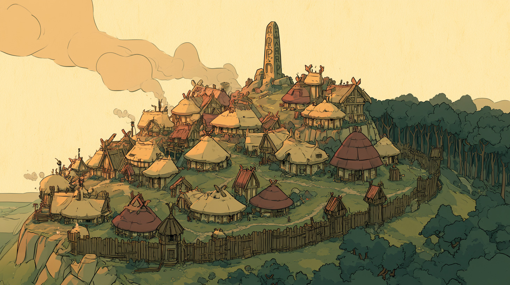
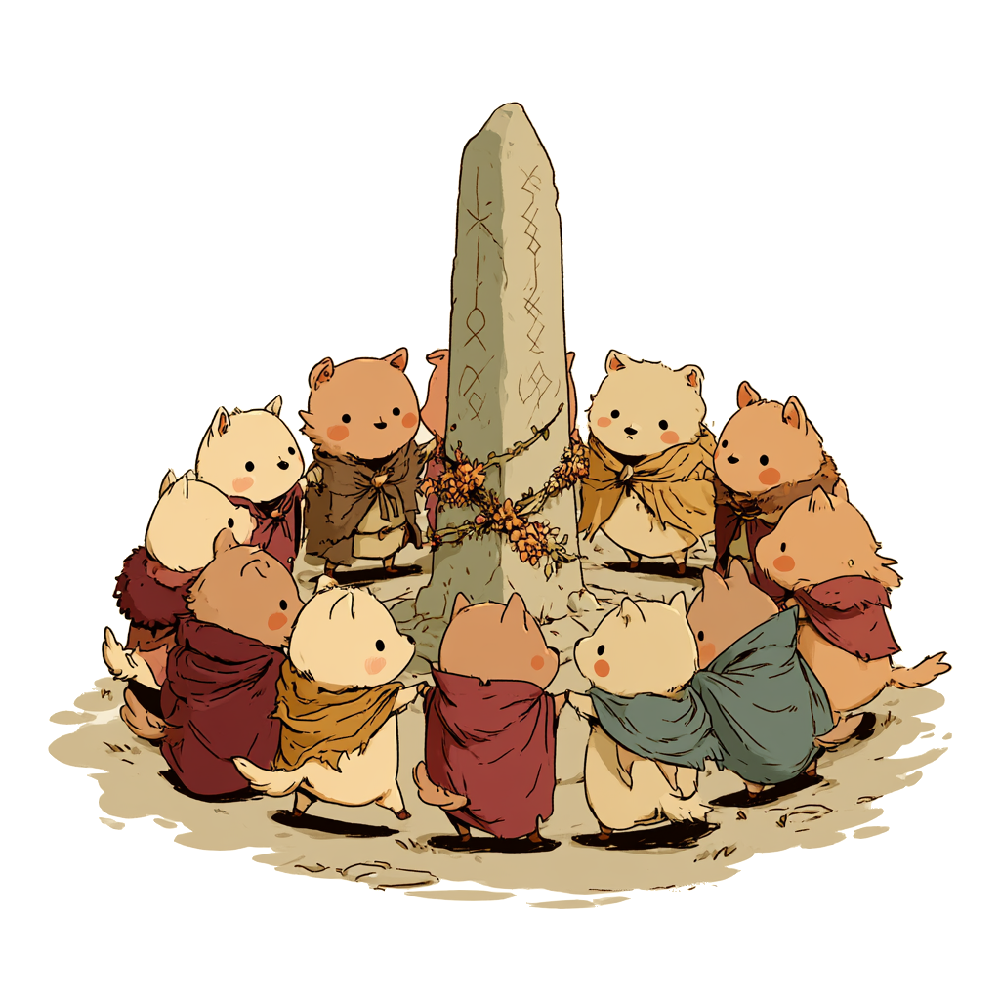
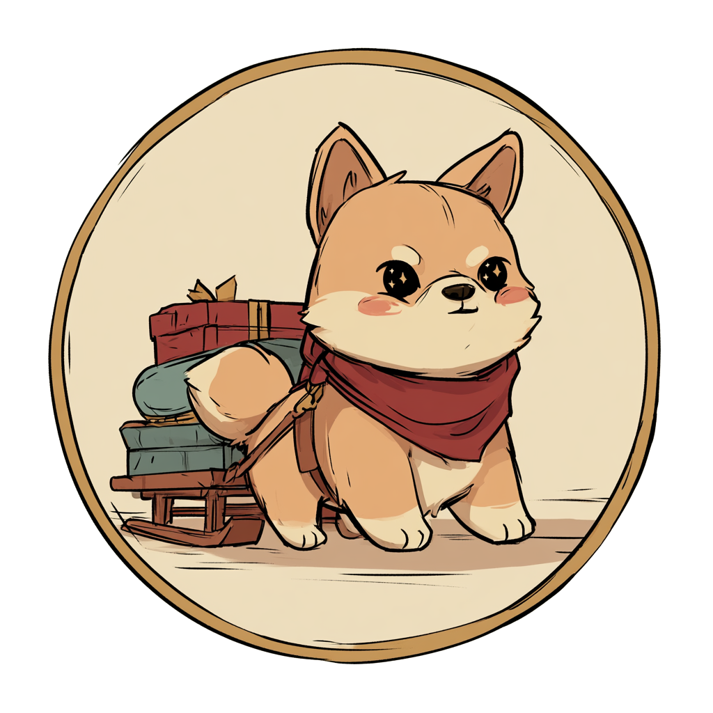
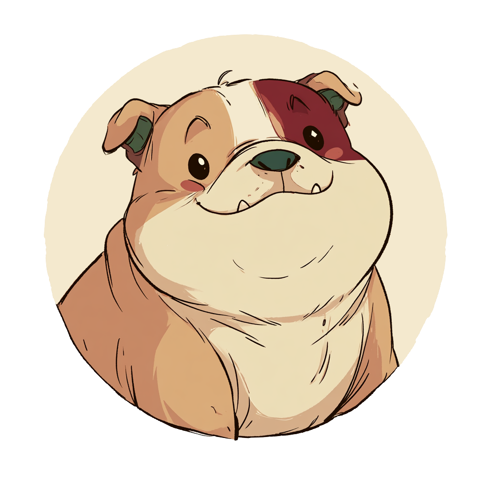

  

<h1 align="center">Sled Dog — feedback & roadmap</h1>

<em>Bug reports, feature requests, and the public roadmap for <a href="https://sleddog.tools">Sled Dog</a>, the Stonetop campaign manager.</em>

  <a href="https://github.com/Pup-Pup-Games/Sleddog-Feedback/issues/new?template=bug_report.yml"><strong>Report a bug</strong></a> ·
  <a href="https://github.com/Pup-Pup-Games/Sleddog-Feedback/issues/new?template=feature_request.yml"><strong>Request a feature</strong></a> ·
  <a href="https://github.com/Pup-Pup-Games/Sleddog-Feedback/discussions"><strong>Ask a question</strong></a> ·
  <a href="https://github.com/orgs/Pup-Pup-Games/projects/1"><strong>See the roadmap</strong></a>

  

---

**This repository holds no code.** It exists so that the things people want from
Sled Dog — and the things that are broken in it — live somewhere public,
searchable, and linked to the work that fixes them. Sled Dog itself is closed
source; this is its front door.

## Where to take what

| What you have | Where it goes |
|---|---|
| Something is broken | [Bug report](https://github.com/Pup-Pup-Games/Sleddog-Feedback/issues/new?template=bug_report.yml) |
| Something should exist | [Feature request](https://github.com/Pup-Pup-Games/Sleddog-Feedback/issues/new?template=feature_request.yml) |
| A question, or "is this a bug or am I misreading the move?" | [Discussions](https://github.com/Pup-Pup-Games/Sleddog-Feedback/discussions) |
| Account, billing, or "please delete my data" | [Contact form](https://sleddog.tools/contact) — never a public issue |
| A security vulnerability | [Private security advisory](https://github.com/Pup-Pup-Games/Sleddog-Feedback/security/advisories/new) |
| Help authoring community content | [SledDog-Community-Content](https://github.com/Pup-Pup-Games/SledDog-Community-Content/issues) |

> **This tracker is public.** Anything you type here can be read by anyone.
> Please keep account details, email addresses, payment information, and
> unblurred screenshots of your table's private notes out of it — use the
> [contact form](https://sleddog.tools/contact) instead and we'll deal with it
> properly.

## What happens to your issue

1. **Triaged** — labelled and put on the right board, usually within a week.
2. **On the roadmap** — accepted work moves through *Now → Next → Later* on the
   public [roadmap](https://github.com/orgs/Pup-Pup-Games/projects).
3. **Closed by a commit** — when the fix ships, the issue closes and says so.

We won't build everything, and we'd rather say so than leave a request open
forever pretending. A closed issue with a reason is a real answer.

👍 on an existing issue is genuinely useful — it's how we tell the difference
between one person's papercut and everyone's.

## Talk to the rest of the table

  

[**Discussions**](https://github.com/Pup-Pup-Games/Sleddog-Feedback/discussions)
is the other half of this repo — questions, how does anyone handle *this*, and
showing off what a year of your campaign looks like. If a question turns out to
be a bug, we'll convert it into an issue for you.

## Play it

  

Sled Dog is a campaign manager for TTRPGs like *Stonetop*: fast character sheets, party
inventory and supplies, the shared steading, and a map that tells you how far the
road is and how much food to pack. Built to be used *during* play, on a phone, at
the table.

  

> **Unofficial, fan-made.** Not affiliated with, endorsed by, or sponsored by
> Lampblack & Brimstone or Jeremy Strandberg. Compatible with *Stonetop* by
> Jeremy Strandberg — you'll need a copy to use it.

## Support Pup Pup Games

Sled Dog is made by a very small studio. If you'd like to help us keep building:

  
  

---

   
  <em>Pup Pup Games. Silly games for serious fun.</em>

